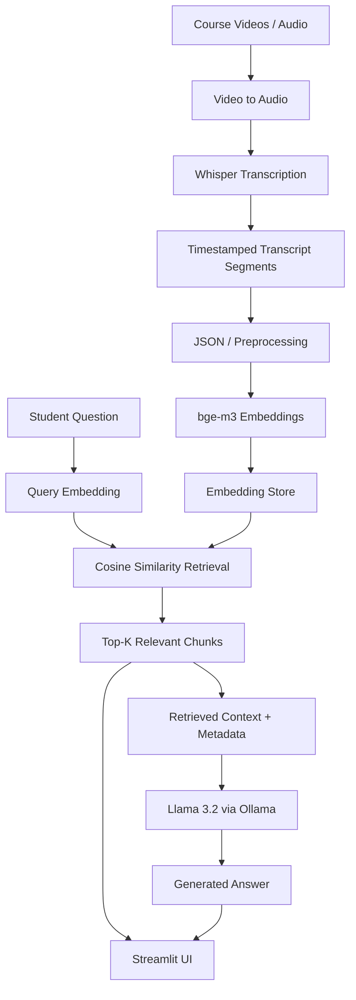
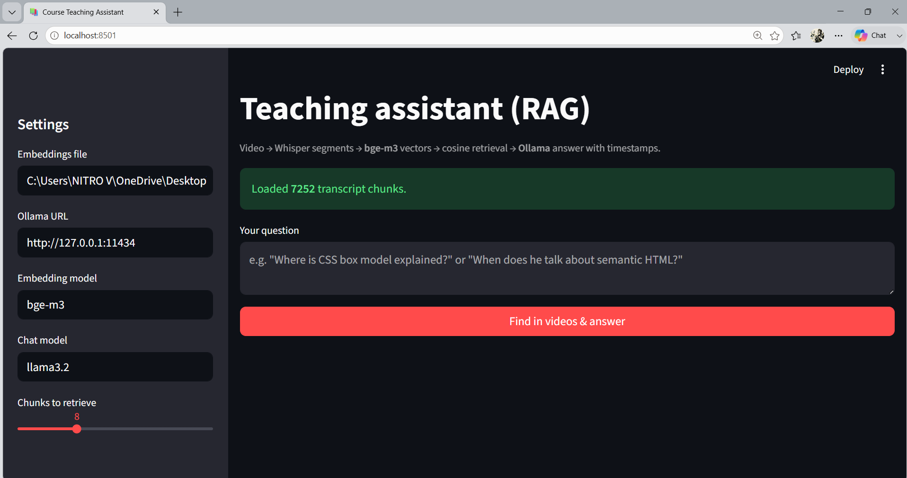
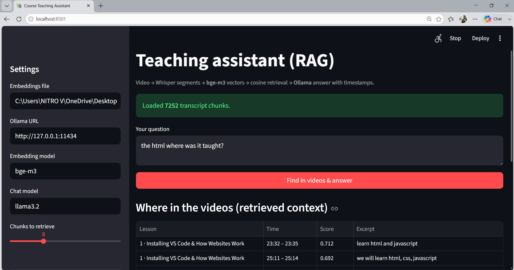
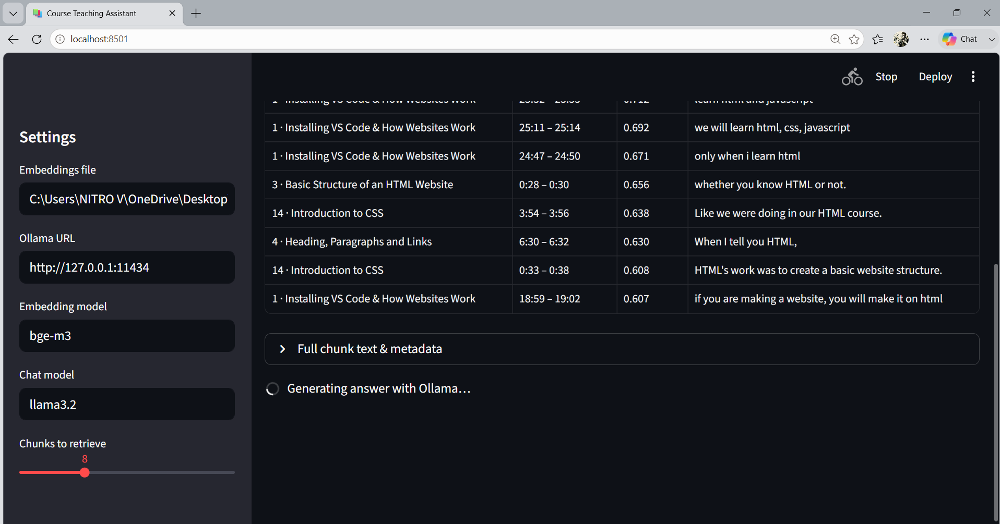
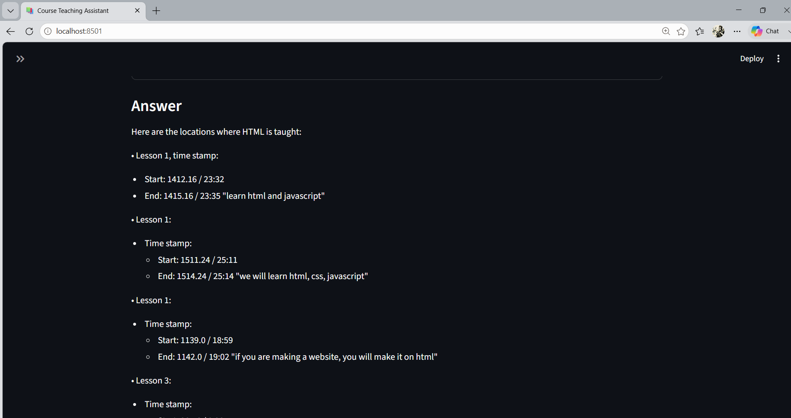

# 🎓 RAG Course Teaching Assistant

> A local Retrieval-Augmented Generation (RAG) teaching assistant that lets students ask natural-language questions about course videos and receive answers grounded in indexed course material, with relevant lessons, similarity scores, transcript excerpts, and timestamps.


---

## 📌 Overview

Finding one explanation inside a long course playlist is time-consuming. This project converts course video/audio material into a searchable transcript knowledge base and lets a student ask questions in natural language.

For example:

> **"Where was semantic HTML explained?"**

Instead of manually searching every video, the system retrieves the most relevant transcript chunks, shows where they occur, and passes the retrieved context to a local LLM to generate an answer.

### Highlights

- 🔎 Semantic search rather than exact keyword matching
- 🎯 Top-K transcript retrieval
- ⏱️ Lesson names and timestamps
- 📊 Similarity scores and transcript excerpts
- 🧠 Retrieval-Augmented Generation with a local LLM
- 🖥️ Streamlit interface
- 🔐 Local-first generation through Ollama

---

# 🧠 What Does RAG Mean?

**RAG = Retrieval-Augmented Generation.**

A normal LLM can answer general questions from knowledge learned during training. A course-specific assistant needs access to the actual course material.

A basic LLM workflow is:

```text
Question → LLM → Answer
```

This project adds retrieval:

```text
Student Question
       ↓
Query Embedding
       ↓
Semantic Similarity Search
       ↓
Top-K Relevant Course Chunks
       ↓
Retrieved Context + Question
       ↓
Llama 3.2 via Ollama
       ↓
Generated Answer
```

### In simple words

The system first asks:

> **"Which parts of the course are most relevant to this question?"**

Then it asks the LLM:

> **"Using those retrieved parts of the course, formulate a useful answer."**

This keeps course knowledge outside the LLM's parameters and makes the knowledge base easier to update.

---

# 🏗️ System Architecture



---

# 🔄 End-to-End Pipeline

## 1. Ingestion

The original course consists of video/audio learning material.

```text
Videos / Audio
      ↓
Audio extraction
      ↓
Transcription
```

The raw multimedia files are intentionally excluded from GitHub because of their size. The repository contains the processed artifacts and code needed to work with the knowledge base.

## 2. Transcription

Audio is converted into timestamped transcript segments.

A segment can contain:

```text
Lesson:
Installing VS Code & How Websites Work

Time:
23:32 - 23:35

Text:
"learn html and javascript"
```

Keeping timestamps means the system can identify **where** a concept was taught, not just what text matched.

## 3. Preprocessing

Transcript data is cleaned and converted into structured JSON suitable for retrieval.

The processed transcript files are stored under `jsons/`.

## 4. Embeddings

Transcript chunks are converted into vector representations using **bge-m3**.

Conceptually:

```text
"HTML provides the structure of a webpage"
                    ↓
              bge-m3
                    ↓
        [0.021, -0.173, 0.442, ...]
```

Semantically similar text should have similar vector representations.

## 5. Semantic Retrieval

When the student asks a question, the question is embedded and compared with stored transcript embeddings using **cosine similarity**.

```text
Question
   ↓
Query Vector
   ↓
Compare with transcript vectors
   ↓
Rank by similarity
   ↓
Top-K chunks
```

The UI exposes the retrieved results and their similarity scores.

## 6. Generation

The most relevant transcript chunks are provided as context to the local LLM.

The LLM then generates the final response using the retrieved course context.

---

# 🔍 Explainability

A major feature of this project is that the retrieval stage is **visible and inspectable**.

Many RAG applications only display:

```text
Question → Answer
```

This application also exposes:

```text
Question
   ↓
Retrieved chunks
   ↓
Lesson + timestamp
   ↓
Similarity score
   ↓
Transcript excerpt
   ↓
LLM answer
```

### What the user can inspect

| Information | Why it matters |
|---|---|
| **Lesson** | Identifies the source lecture |
| **Timestamp** | Shows where the concept appears |
| **Similarity score** | Shows how closely the chunk matched the query |
| **Transcript excerpt** | Lets the user inspect retrieved evidence |
| **Full chunk / metadata** | Helps debug retrieval |

For example, a query such as:

> **"Where was HTML taught?"**

can return a result such as:

```text
Lesson:
Installing VS Code & How Websites Work

Time:
23:32 – 23:35

Score:
0.712

Excerpt:
"learn html and javascript"
```

### Why this is useful

This makes the system easier to:

- Debug
- Evaluate
- Tune
- Understand
- Trust

It also lets the developer distinguish between a **retrieval problem** and a **generation problem**.

> **Important:** A similarity score measures semantic similarity, not factual correctness. A high score does not automatically mean the retrieved text or generated answer is correct.

---

# 🖥️ Application Screenshots

## Main Interface

The UI exposes the embedding file, Ollama endpoint, embedding model, chat model, and number of chunks to retrieve.



## Retrieved Context

After a question is submitted, the system displays relevant lessons, timestamps, similarity scores, and transcript excerpts.



## Retrieval Details

The interface also provides deeper chunk and metadata visibility for inspecting the retrieval process.



## Generated Answer

The final response is generated from the retrieved course context. The answer includes lesson and timestamp information, helping the student connect the response back to the original teaching material.



---

# ✨ Key Features

### 🎓 Course-aware Q&A
Ask questions in natural language about the indexed course.

### 🔎 Semantic retrieval
Search by meaning using embeddings rather than exact keyword matching.

### ⏱️ Timestamp-aware results
Retrieve lesson and timestamp metadata alongside transcript content.

### 📊 Retrieval transparency
Expose similarity scores and transcript excerpts.

### 🧠 Local LLM
Generate answers using Llama 3.2 through Ollama.

### ⚙️ Configurable Top-K
Control how many chunks are retrieved from the interface.

### 🧩 Modular pipeline
Separate media conversion, transcript processing, embedding generation, retrieval, and UI logic.

---

# 📂 Project Structure

```text
RAG_based_teaching_Assistant/
│
├── app.py                  # Streamlit application / UI
├── rag_core.py             # Core retrieval and RAG logic
├── run_pipeline.py         # Pipeline orchestration
│
├── video_to_mp3.py         # Video → audio conversion
├── mp3_to_json.py          # Audio/transcript → JSON
├── preprocess_json.py      # Transcript preprocessing
├── process_incoming.py     # Incoming data processing
│
├── embeddings.joblib       # Pre-generated embedding artifact
│
├── jsons/                  # Processed transcript knowledge base
│   └── *.json
│
├── prompt.txt              # Generation prompt/instructions
├── report/                 # Project report
├── requirements.txt        # Python dependencies
├── .gitignore              # Version-control exclusions
└── README.md
```

---

# 🛠️ Tech Stack

| Technology | Role |
|---|---|
| **Python** | Core implementation |
| **Streamlit** | Interactive UI |
| **Whisper** | Speech-to-text transcription |
| **bge-m3** | Text embeddings |
| **Cosine Similarity** | Semantic retrieval |
| **Ollama** | Local LLM runtime |
| **Llama 3.2** | Answer generation |
| **JSON** | Transcript storage |
| **Joblib** | Serialized embedding artifact |

---

# 🚀 How to Run

## Prerequisites

- Python 3.x
- Ollama
- Required packages from `requirements.txt`

## 1. Clone

```bash
git clone https://github.com/pkandpal27-crypto/RAG_based_teaching_Assistant.git
cd RAG_based_teaching_Assistant
```

## 2. Create a virtual environment

Windows:

```powershell
python -m venv .venv
.venv\Scripts\activate
```

macOS/Linux:

```bash
python3 -m venv .venv
source .venv/bin/activate
```

## 3. Install dependencies

```bash
pip install -r requirements.txt
```

## 4. Start Ollama

Make sure Ollama is running locally and the configured chat model is available.

The demonstrated configuration is:

```text
Ollama URL: http://127.0.0.1:11434
Chat model: llama3.2
Embedding model: bge-m3
```

## 5. Start the application

```bash
streamlit run app.py
```

Open:

```text
http://localhost:8501
```

> **Note:** The original course videos/audio are not included in GitHub because the raw multimedia is large. Processed transcript JSON and the embedding artifact are included. The ingestion scripts can be used with the source media when rebuilding the knowledge base locally.

---

# 🧪 Example

A student asks:

```text
Where was HTML taught?
```

The system performs:

```text
Question
   ↓
Query embedding
   ↓
Cosine similarity
   ↓
Top-K transcript chunks
   ↓
Relevant lessons + timestamps
   ↓
Retrieved context
   ↓
Llama 3.2
   ↓
Answer
```

The user can inspect the retrieved evidence before/alongside the generated answer.

---

# ⚙️ Engineering Decisions

## Why RAG instead of fine-tuning?

Fine-tuning changes model parameters and is unnecessary when the main requirement is to answer questions about a specific, updateable knowledge base.

With RAG:

```text
Course Material
      ↓
Knowledge Base
      ↓
Retrieve relevant information
      ↓
LLM
```

New course content can be indexed without retraining the LLM.

## Why embeddings?

Keyword search can miss semantically related questions.

For example:

```text
Query:
"How are web pages structured?"

Transcript:
"HTML provides the basic structure of a website."
```

The wording differs, but the meaning is related. Embeddings allow semantic comparison.

## Why cosine similarity?

Cosine similarity compares the direction of vector representations and is widely used for embedding-based similarity search.

Conceptually:

```text
Similar meaning
      ↓
Similar vector direction
      ↓
Higher similarity
```

## Why Ollama?

Ollama allows the generation model to run locally, which is useful for development and demonstrations where keeping course queries on the local machine is desirable.

---

# ⚠️ Limitations

1. Retrieval quality depends on transcript quality.
2. Chunking strategy affects retrieval quality.
3. Similarity score is not a direct measure of truth.
4. The LLM can still generate an incorrect answer.
5. The current embedding artifact represents the available course corpus.
6. Large-scale deployment would require more scalable storage and retrieval infrastructure.

---

# 🔮 Future Improvements

- [ ] Hybrid keyword + semantic retrieval
- [ ] Reranking of retrieved chunks
- [ ] Dedicated vector database such as FAISS, Qdrant, or pgvector
- [ ] Direct links to exact video timestamps
- [ ] Conversation memory
- [ ] Retrieval and generation evaluation datasets
- [ ] Automated RAG evaluation metrics
- [ ] Multi-course support
- [ ] User authentication
- [ ] Docker deployment
- [ ] Background ingestion for newly uploaded course material

---

# 📈 Evaluation Plan

A production RAG system should be evaluated separately at the retrieval and generation stages.

### Retrieval

- Recall@K
- Precision@K
- Mean Reciprocal Rank (MRR)

### Generation

- Faithfulness / groundedness
- Answer relevance
- Context relevance

### System

- Retrieval latency
- Generation latency
- Indexing time
- Memory usage

Separating these metrics helps identify whether a poor answer came from **retrieving the wrong context** or **generating poorly from good context**.

---

# 🎯 Project Goal

The goal is to transform unstructured educational multimedia into an **interactive, searchable, and inspectable knowledge system** using speech-to-text, embeddings, semantic retrieval, and Retrieval-Augmented Generation.

> **Don't make the student search the entire course. Let the system retrieve the relevant teaching context and show the student where it came from.**

---

## 📄 Project Report

A detailed project report is available in [`report/`](report/).

## 🔗 Repository

https://github.com/pkandpal27-crypto/RAG_based_teaching_Assistant

---

## ⭐ Key Takeaway

This project demonstrates an end-to-end RAG workflow:

```text
Multimedia
    ↓
Transcription
    ↓
Structured transcript
    ↓
Embeddings
    ↓
Semantic retrieval
    ↓
Explainable retrieved context
    ↓
Local LLM
    ↓
Course-aware answer
```
